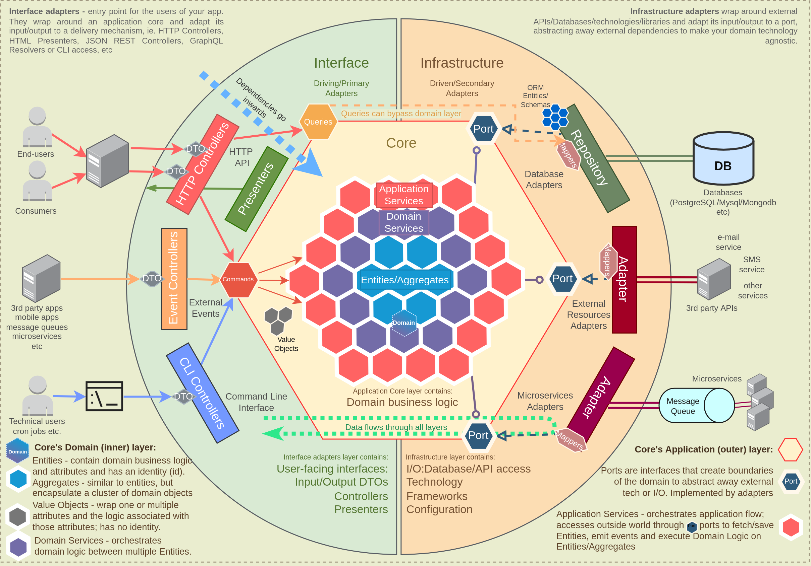

# Go Hexagonal Wallet Service



Bu proje, Go dilinde **Hexagonal Architecture (Ports and Adapters)** prensipleri kullanılarak geliştirilmiş modern bir cüzdan (wallet) servisidir.

## 🏗 Mimari Yapı

Proje, bağımlılıkların içe doğru (core'a doğru) olduğu, iş mantığının dış dünyadan (DB, API, CLI) tamamen izole edildiği bir yapıdadır.

- **Internal/Core/Domain:** Uygulamanın kalbi. Cüzdan, İşlem (Transaction), Kullanıcı (User) modelleri ve temel iş kuralları burada yer alır.
- **Internal/Core/Ports:** Uygulamanın dış dünya ile iletişim kontratları (Interface'ler).
- **Internal/Core/Service:** İş mantığının (Use-Case) koordine edildiği katman.
- **Internal/Adapters:**
    - **Inbound (Driving):** HTTP Handlers.
    - **Outbound (Driven):** Thread-safe bellek tabanlı veri deposu.
- **Internal/Api/Dto:** API istek ve yanıt şablonları.

## 🚀 Başlangıç

### Gereksinimler
- Go 1.25 veya üzeri

### Kurulum ve Çalıştırma
1. Projeyi klonlayın ve bağımlılıkları yükleyin:
   ```bash
   go mod download
   ```
2. Uygulamayı ayağa kaldırın:
   ```bash
   go run cmd/main.go
   ```

## 🛠 API Uç Noktaları (Endpoints)

### 1. Yeni Cüzdan Oluşturma (POST `/wallets`)
```bash
curl -X POST http://localhost:8080/wallets \
  -H "Content-Type: application/json" \
  -d '{"owner": "Gökhan", "currency": "TRY"}'
```

### 2. Cüzdan Bilgilerini Getirme (GET `/wallets/{id}`)
```bash
curl -X GET http://localhost:8080/wallets/<wallet_id>
```

### 3. Para Yatırma (POST `/wallets/{id}/deposit`)
```bash
curl -X POST http://localhost:8080/wallets/<wallet_id>/deposit \
  -H "Content-Type: application/json" \
  -H "X-Idempotency-Key: <unique_key>" \
  -d '{"amount": 150.75}'
```

### 4. Para Çekme (POST `/wallets/{id}/withdraw`)
```bash
curl -X POST http://localhost:8080/wallets/<wallet_id>/withdraw \
  -H "Content-Type: application/json" \
  -H "X-Idempotency-Key: <unique_key>" \
  -d '{"amount": 50.25}'
```

### 5. Kayıt Çekme (GET `/wallets/{id}/transactions`)
```bash
curl -X GET http://localhost:8080/wallets/<wallet_id>/transactions
```

## 🛠 Özellikler
- [x] Cüzdan Oluşturma
- [x] Cüzdan Bakiyesi Sorgulama
- [x] Para Yatırma ve Çekme (Float to Cents dönüşümü)
- [x] Eşzamanlılık Kontrolü (Optimistic Locking)
- [x] Idempotency (X-Idempotency-Key desteği)
- [x] İşlem Geçmişi Kaydı (Transaction History)
- [x] Temel Kullanıcı ve JWT yapıları

## 🗺 Yol Haritası (Roadmap)

1. **Security & Identity (Kimlik Doğrulama Katmanı):**
    - JWT tabanlı kimlik doğrulama mekanizmasının tam entegrasyonu.
    - Kullanıcı kayıt ve giriş (Auth) uç noktalarının aktif edilmesi.
2. **Resilience & Defense (Rate Limiter Katmanı):**
    - API uç noktaları için Rate Limiter (istek hız sınırlayıcı) entegrasyonu.
    - Servis katmanında koruma mekanizmaları.
3. **Production-Grade Persistence (Veri Tabanı Geçişi):**
    - Bellek tabanlı depolamadan PostgreSQL (veya benzeri RDBMS) geçişi.
    - Veritabanı migrasyon yönetimi.
4. **Next-Level Critical Business Services (Kritik Finansal Servisler):**
    - Çoklu para birimi desteği ve kur yönetimi.
    - Kapsamlı raporlama ve denetim (audit) mekanizmaları.

## 📈 Proje Durumu
Proje, temel iş mantığı ve güvenli işlem yapısını (idempotency, concurrency control) tamamlamış durumdadır. Bir sonraki aşamada kimlik doğrulama (Security & Identity) katmanının aktif edilmesine odaklanılacaktır.
